# DOM_JS_Excercise
# Dom Manipulation Assignment

1. Webiste Name: [Dev To](https://dev.to/)

### Topics

    - Query Selctory, Inner HTML

### Sample Image


### Tasks

        Target the Top description div and change the DEV Community to <Your_Name> and description to your passion

### Output


### My Output

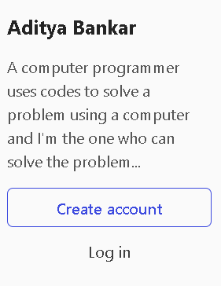
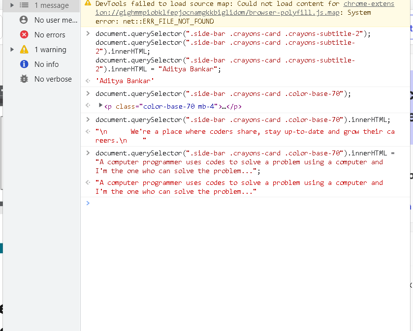

2. Website Name: [Apple](https://support.apple.com/en-in)

### Task


### Fetch all the product name and store in an array

### Output

['iPhone', 'Mac', 'iPad', 'Watch', 'AirPods', 'Music', 'TV']

### My Output

```
let container = document.querySelector(".as-imagegrid .as-imagegrid--7up .row");

let list = container.querySelectorAll(".as-imagegrid-item .as-imagegrid-item-title");
const finalItem= [];
for (let item of list) {
    finalItem.push(item.textContent.split(" ").splice(0,1).join());
}
console.log(finalItem);

```

3. Webiste Name: [Youtube Support](https://support.google.com/youtube/)

### Topics

    - Get Element By Id, Create Element, Create Text Node, Append Child

### Sample Image


### Tasks

     Add another FAQ 'My New FAQ' to the list

### Output


### My Output

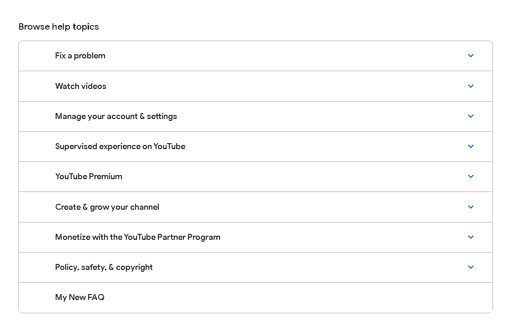

```
let containerId = document.querySelector(".accordion-homepage");
let addTab = document.createElement("section"); 
let newContent = document.createTextNode("My New FAQ"); 
addTab.appendChild(newContent); 
containerId.appendChild(addTab); 
addTab.setAttribute("id","newsection");
let sectionById = document.getElementById("newsection");
sectionById.style.background = "#FFFFFF";
sectionById.style.padding = "16px 52px 16px 64px";
sectionById.style.fontFamily = "'Google Sans', 'Google Sans Text', Roboto, sans-serif";
sectionById.style.borderTop = "thin solid #a9acaa";
sectionById.style.fontSize = ".875rem";
sectionById.style.fontWeight ="500";

```

4. Webiste Name: [OnePlus](https://www.oneplus.in/support)

### Topics

     Query Selector, InnerText

### Sample Image


### Tasks

      Change the contact number

### Output


### My Output

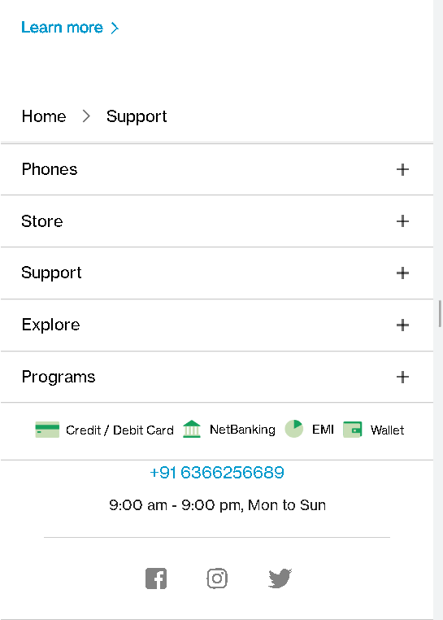

```
let div = document.querySelector(".one-tel-number");
div.innerText = "+91 6366256689";

```

5. Webiste Name: [Samsung](https://www.samsung.com/in/offer/online/samsung-fest/)

### Topics

       getElementById, createElement, InnerText, append, setAttribute

### Sample Image


### Tasks

     Target the main div of card and change the Button text to Check out

### Output

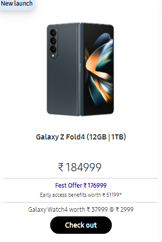

### My Output

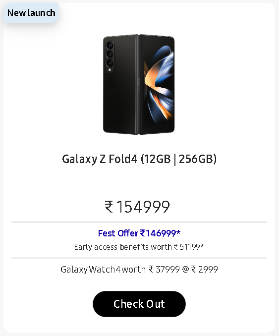

```
let mainDiv = document.querySelectorAll(".mytabs .diwali-deals-product-sale-pro .diwali-deals-product-sale-btn");
mainDiv.forEach((e) => {
    if(e.getAttribute("href") == "//www.samsung.com/in/smartphones/galaxy-z-fold4/buy/?modelCode=SM-F936BZKD"){
     e.innerText = "Check Out";
    }
} );

```

6. Webiste Name: [Adidas](https://www.adidas.co.in/)

### Topics

    -   Query Selector, Event listeners, Changing Styles

### Sample Image


### Tasks

     Target the search box and on hover change thebackground color to red.

### Output


### My Output


```
let search = document.querySelector(".searchinput___19uW0");

function mouseOver(){
    document.querySelector(".searchinput___19uW0").style.backgroundColor = "Red";
}

search.addEventListener("mouseover", mouseOver); 

```

7. Webiste Name: [MDN Web Docs](https://developer.mozilla.org/en-US/)

### Topics

       Form, Value, Submit

### Sample Image


### Tasks

     To Search a topic in the MDN Search bar.
     First add a text to search in the search bar and then hit the submit search button to search the docs using DOM

### Output


### My Output


```
let inputTab = document.getElementById("top-nav-search-input");
inputTab.value = "Css Selector";
let submit = document.querySelectorAll(".header-search .search-button");
let form1 = document.getElementById("top-nav-search-form");
form1.submit();
```

8. Webiste Name: [Google](https://www.google.com/)

### Topics

       Remove Elements

### Sample Image


### Tasks

     Remove alternate languages from the home page languages listed

### Output


### My Output

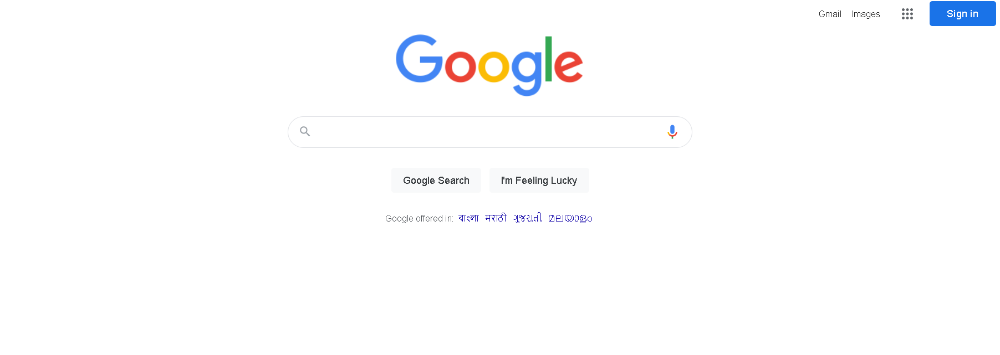

```
let selectAlternateLanguages = document.querySelectorAll("#SIvCob a");
for (i = 0; i < selectAlternateLanguages.length; i++) {
  if(i % 2 == 0) {
    selectAlternateLanguages[i].remove();
  }
}
console.log(selectAlternateLanguages);

```

9. Webiste Name: [Code Wars](https://www.codewars.com/)

### Topics

       Change Font Family, Color of Text.

### Sample Image


### Tasks

    Change the font family of the text to monospace and text color to the logo’s background color.

### Output


### My Output

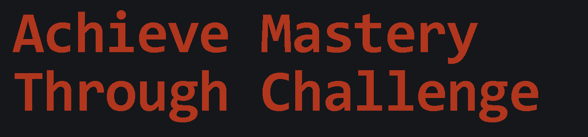

```
let heading = document.querySelector(".display-heading-1");
heading.style.color = "#B1361E"
heading.style.fontFamily = "monospace";

```

10. Webiste Name: [Freecodecamp](https://www.freecodecamp.org/)

### Topics

       querySelector, mouseover, click eventListener,  callback function, style,

### Sample Image


### Tasks

    Target the button and change background colour on mouseover

### Output


### My Output

```
let text = document.querySelector("btn-cta-big .login-btn-text");
let mainButton = document.querySelector(".btn-cta-big");

function mouseHover(){
    text.style.background = "Red";
}

mainButton.addEventListener("mouseenter", mouseHover);

```

11. Webiste Name: [realme](https://www.realme.com/in/)

### Topics

       querySelector,style,background-image

### Sample Image


### Tasks

    change the realme logo to ineuron logo

### Output


### My Output


```
let icon = document.querySelector(".icon-logo");
icon.style.backgroundImage = "url('https://learn.ineuron.ai/_next/image?url=%2Fimages%2Fineuron-logo.png&w=750&q=75')"

```

12. Webiste Name: [Github](https://github.com/)

### Topics

       querySelector,style,background-Color

### Sample Image


### Tasks

     change the background colour of the button to blue.

### Output


### My Output

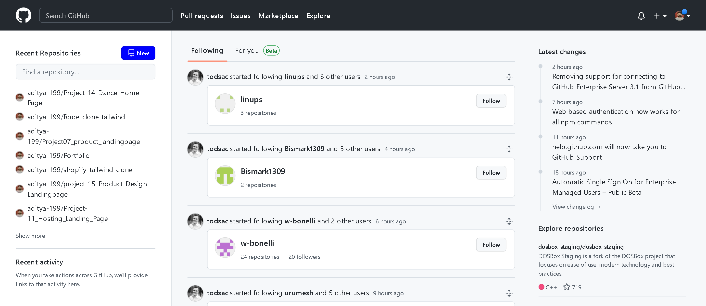

```
document.querySelector('.btn-primary').style.backgroundColor = "Blue";

```

13. Webiste Name: [Hackerrank](https://www.hackerrank.com/)

### Topics

       querySelector,innerHtml

### Sample Image


### Tasks

Target the top description and change “Matching developers with great companies” to ‘JSBOOTCAMP“.

### Output


### My Output

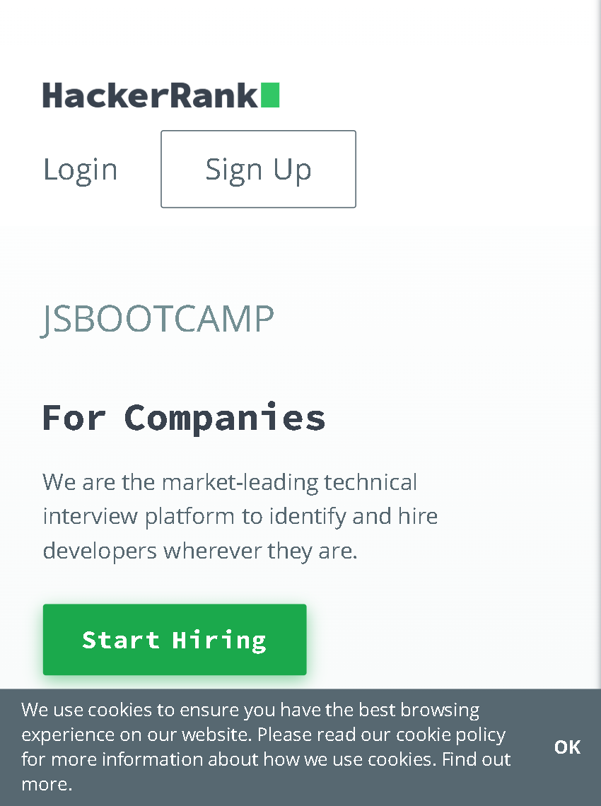

```
document.querySelector(".fl-heading-text").textContent = "JSBOOTCAMP";

```

14. Webiste Name: [Asus](https://www.asus.com/in/)

### Topics

      querySelector,style,font-size

### Sample Image


### Tasks

       change the fontsize of “Hot Deals” to 80px

### Output


### My Output

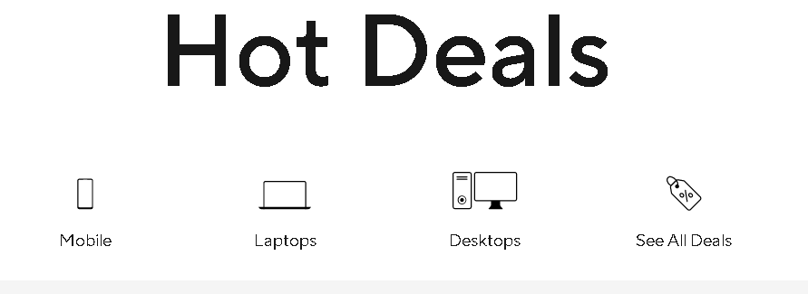

```
document.querySelector(".HotDealsAll__Heading__2fIbe").style.fontSize = "90px";

```

15. Webiste Name: [Dell](https://www.dell.com/en-in/shop/deals/laptop-deals?gacd=10415953-9016-5761040-285981356-0&dgc=ST&gclid=Cj0KCQjwguGYBhDRARIsAHgRm4-XUDMhhVNyHXb3s1gY4ZBzORr_d9Se-buhJwy7asyUe7YdqEA11eEaAt6UEALw_wcB&gclsrc=aw.ds&nclid=BxjBlpBQsX6pjSHh-L8YYSU77EpfXRkG1AGMB5Wbeu386ykspfrPDnfx_DdFau20)

### Topics

      querySelector,style.textAlign

### Sample Image


### Tasks

       Convert the text “G15 Gaming Laptop” from left to right

### Output

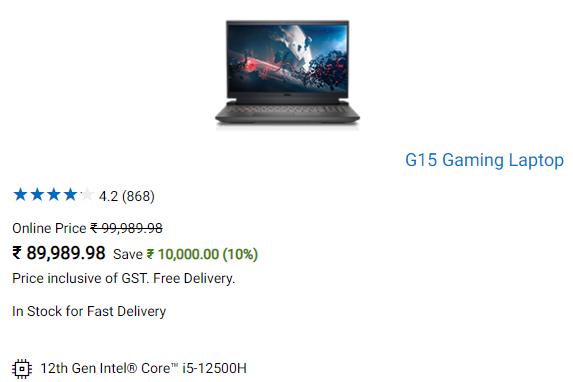

### My Output

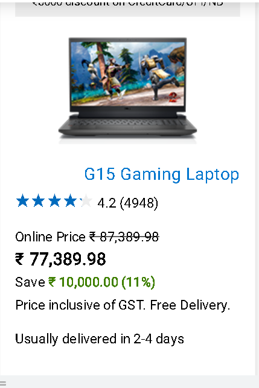

```
let listOfLaptops = document.querySelectorAll(".ps-title");
listOfLaptops.forEach((e) => {
    if(e.querySelector("a").getAttribute("href") =="//www.dell.com/en-in/shop/work-from-home-deals/g15-gaming-laptop/spd/g-series-15-5511-laptop/d560824win9b"){e.style.textAlign = 'right'};
} );

```

16. Webiste Name: [Vercel](https://vercel.com/)

### Topics

     querySelector,innerHTMl

### Sample Image


### Tasks

      change the heading “Start with the developer” to “Start with Scratch”

### Output


### My Output

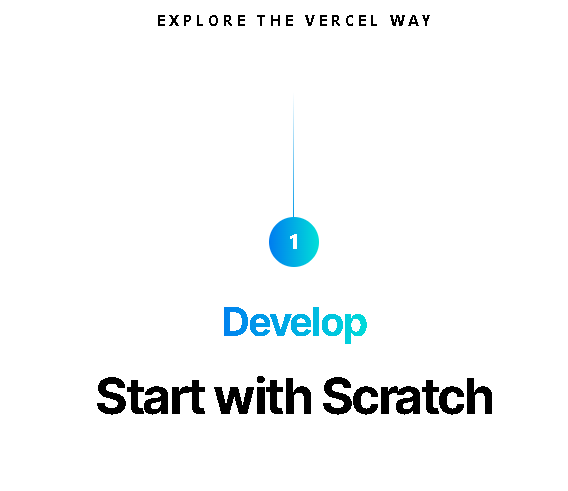

```
let nameChange = document.querySelector(".section-title_title__VEDfK");
nameChange.innerHTML = "Start with Scratch"

```

17. Webiste Name: [Sony](https://www.sony.co.in/)

### Topics

    querySelector,innerHTMl

### Sample Image


### Tasks

     change the button text To current Date.

### Output


### My Output

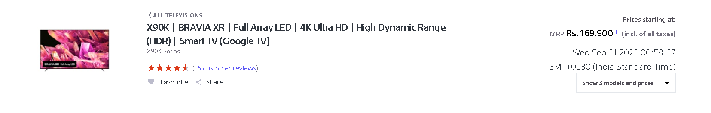

```
let changeTodate = document.querySelector(".btn-container");
changeTodate.innerHTML = Date();

```

18. Webiste Name: [Philips](https://www.philips.co.in/)

### Topics

     querySelector,style,backgroundcolor

### Sample Image


### Tasks

    change the background colour blue to orange

### Output

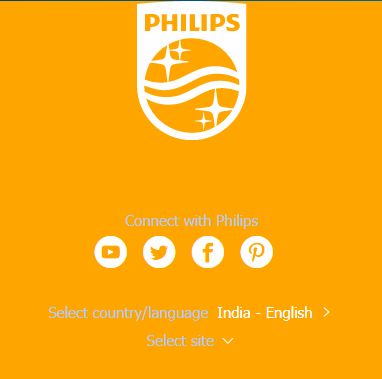

### My Output

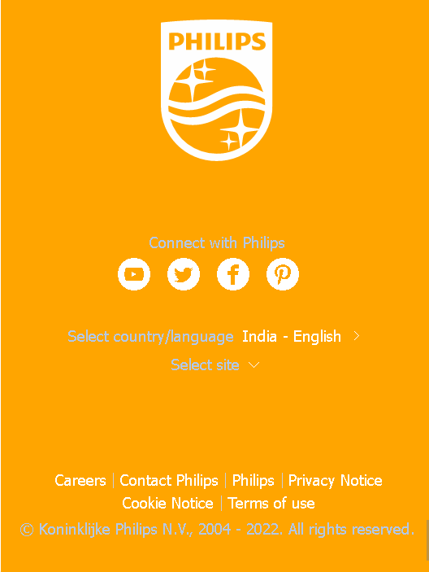

```
let changeColor = document.querySelector(".p-f03-footer-container");
changeColor.style.background = 'none';
changeColor.style.backgroundColor = 'Orange';

```

19. Webiste Name: [Canon](https://in.canon/)

### Topics

          querySelector,src

### Sample Image


### Tasks

    extract the canon logo

### Output


### My Output


```
let sourceExtract = document.querySelector(".logo");
sourceExtract.getAttribute("Src");

```


20. Webiste Name: [Oppo](https://www.oppo.com/in/)

### Topics

          querySelector,style,color

### Sample Image


### Tasks

      Change the description colour black to orange

### Output


### My Output

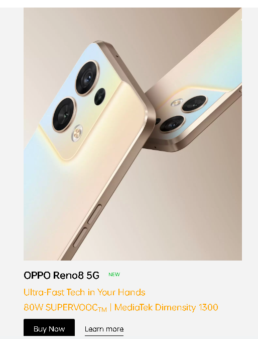

```
let descColorChange = document.querySelector(".product-card-content .wide .desc");
descColorChange.style.color = "Orange";

```
